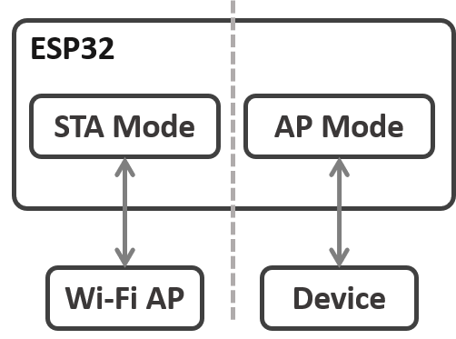
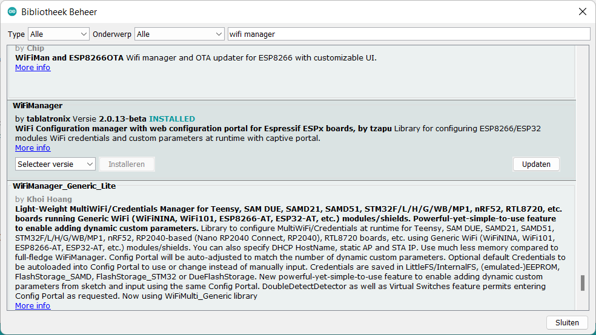
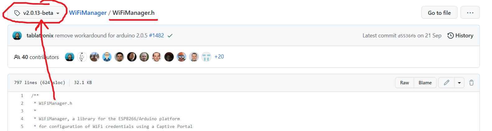

# Inleiding

Wanneer een toestel aangekocht wordt die verbinding moet maken met een privé netwerk is de manier van werken meestal als volgt:
1. Het  toestel start op in *acces point* (AP) mode en creëert hierbij een WiFi netwerk met een eigen SSID waarop *gebruikers* kunnen verbinden. Bij het verbinden met het netwerk krijgt de gebruiker een *landingspagina* voorgeschoteld (dit is de *captive portal*), waarop de essentiële instellingen kunnen gemaakt worden. Bij de meest essentiële instellingen behoort de keuze om te verbinden met het privé netwerk van de gebruiker met bijhorend wachtwoord. Optionele instellingen kunnen hier ook gemaakt worden.
2. Bij het opslaan van de instellingen herstart het toestel. Aangezien dit toestel nu voorzien is van instellingen start het niet meer op in *__a__cces __p__oint* mode (AP), maar in *__sta__tion* mode (STA). Hierbij probeert het toestel verbinding te maken met het privé netwerk door gebruik te maken van de nodige *credentials* die opgegeven zijn in vorige stap.
	* Slaagt het  toestel er in om een verbinding te maken, dan is de software voor instellingen en verbinding te maken niet meer van toepassing en kan overgeschakeld worden op de effectieve software van het toestel.
	* Slaagt het toestel er niet in om een verbinding te maken, dan is het meest logische om terug te herstarten in AP-mode zodat de gebruiker wijzigingen kan doorvoeren aan de instellingen.

	
Tijdens deze module worden de meest essentiële zaken aangehaald in verschillende stappen, gaande van basis tot expert.
1. [Basis configuratie](#basis-captive-portal) voor het *captive portal* om verbinding te maken met een privé netwerk
2. Opstarten van het *captive portal* op [aanvraag](#captive-portal-on-request) van de gebruiker
3. [Extra instellingen](#extra-instellingen) afvragen en opslaan
4. [Custom](#custom-menus--html) menu's / HTML

# Installatie bibiliotheek

In principe zouden we alles van nodige software zelf kunnen schrijven, maar de gebruikers *tablatronix* en *tzapu* op GitHub hebben reeds een bibliotheek ontwikkeld die geschikt is voor dit doel. We gaan dan ook gebruik maken van deze bibliotheek.

In de Arduino omgeving kan via *schets* -> *Bibliotheek gebruiken* -> *Bibliotheken beheren* de nodige bibliotheek geïnstalleerd worden. Zoek hiervoor in de lijst "wifi manager" van de gebruiker *tablatronix*, en installeer vervolgens deze.

Merk op dat deze bibliotheek zeer uitgebreid is en dat er momenteel nog veel wordt aan ontwikkeld. Op het moment van schrijven is er gebruik gemaakt van versie 2.0.13-beta, waarbij de beta betekent dat er opties aanwezig zijn die nog niet 100% werkende zijn bevonden. Deze opties kunnen in recentere versies anders werken of misschien zelf niet meer aanwezig zijn. Voor een lijst van mogelijkheden wordt altijd verwezen naar de [juiste *header*](https://github.com/tzapu/WiFiManager/blob/v2.0.13-beta/WiFiManager.h) file. Deze kan teruggevonden worden in de bibliotheek zelf (die op je systeem wordt gedownload) of in GitHub door langs boven de juiste *tag* te kiezen. 

# Basis captive portal
# Captive portal on request
# Extra instellingen
# Custom menu's & HTML
# OTA