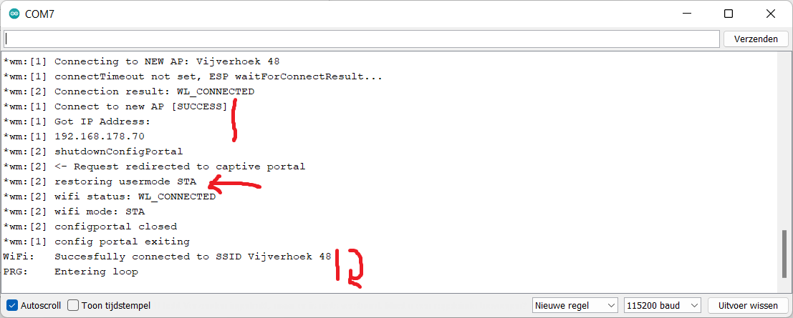

# Inleiding

Wanneer een toestel aangekocht wordt die verbinding moet maken met een privé netwerk is de manier van werken meestal als volgt:
1. Het  toestel start op in *acces point* (AP) mode en creëert hierbij een WiFi netwerk met een eigen SSID waarop *gebruikers* kunnen verbinden. Bij het verbinden met het netwerk krijgt de gebruiker een *landingspagina* voorgeschoteld (dit is de *captive portal*), waarop de essentiële instellingen kunnen gemaakt worden. Bij de meest essentiële instellingen behoort de keuze om te verbinden met het privé netwerk van de gebruiker met bijhorend wachtwoord. Optionele instellingen kunnen hier ook gemaakt worden.


2. Bij het opslaan van de instellingen herstart het toestel. Aangezien dit toestel nu voorzien is van instellingen start het niet meer op in _**a**cces **p**oint_ mode (AP), maar in _**sta**tion_ mode (STA). Hierbij probeert het toestel verbinding te maken met het privé netwerk door gebruik te maken van de nodige *credentials* die opgegeven zijn in vorige stap.
	* Slaagt het  toestel er in om een verbinding te maken, dan is de software voor instellingen en verbinding te maken niet meer van toepassing en kan overgeschakeld worden op de effectieve software van het toestel.
	* Slaagt het toestel er niet in om een verbinding te maken, dan is het meest logische om terug te herstarten in AP-mode zodat de gebruiker wijzigingen kan doorvoeren aan de instellingen.
	

	
Tijdens deze module worden de meest essentiële zaken aangehaald in verschillende stappen, gaande van basis tot expert.
1. [Basis configuratie](#basis-captive-portal) voor het *captive portal* om verbinding te maken met een privé netwerk
2. Opstarten van het *captive portal* op [aanvraag](#captive-portal-on-request) van de gebruiker
3. [Extra instellingen](#extra-instellingen) afvragen en opslaan
4. [Custom](#custom-menus--html) menu's / HTML

# Installatie bibiliotheek

In principe zouden we alles van nodige software zelf kunnen schrijven, maar de gebruikers *tablatronix* en *tzapu* op GitHub hebben reeds een bibliotheek ontwikkeld die geschikt is voor dit doel. We gaan dan ook gebruik maken van deze bibliotheek.

In de Arduino omgeving kan via *schets* -> *Bibliotheek gebruiken* -> *Bibliotheken beheren* de nodige bibliotheek geïnstalleerd worden. Zoek hiervoor in de lijst "wifi manager" van de gebruiker *tablatronix*, en installeer vervolgens deze.


Merk op dat deze bibliotheek zeer uitgebreid is en dat er momenteel nog veel wordt aan ontwikkeld. Op het moment van schrijven is er gebruik gemaakt van versie 2.0.13-beta, waarbij de beta betekent dat er opties aanwezig zijn die nog niet 100% werkende zijn bevonden. Deze opties kunnen in recentere versies anders werken of misschien zelf niet meer aanwezig zijn. Voor een lijst van mogelijkheden wordt altijd verwezen naar de [juiste *header*](https://github.com/tzapu/WiFiManager/blob/v2.0.13-beta/WiFiManager.h) file. Deze kan teruggevonden worden in de bibliotheek zelf (die op je systeem wordt gedownload) of in GitHub door langs boven de juiste *tag* te kiezen. 


# Basis captive portal

Het meest essentiële onderdeel is het verbinden met een privé WiFi-netwerk. Hiervoor gaan we volgende basis code gebruiken:

```cpp
#include <WiFiManager.h>  //https://github.com/tzapu/WiFiManager

void setup(){
  Serial.begin(115200); //needed for debug, library will output a lot (due to beta version)
  WiFiManager portal; //set local, only needed in setup
  bool wifiConnected = portal.autoConnect("615-CaptivePortal"); //create blocking portal which tries to connect to AP if settings have been found
  if(!wifiConnected){
    //provided credentials does not result in connection to AP
    Serial.print("WiFi:\tUnable to connect to SSID ");
    Serial.println(portal.getWiFiSSID());
    portal.resetSettings();  //reset wrong credentials
    while(1); //no need to continue
  }
  Serial.print("WiFi:\tSuccesfully connected to SSID ");
  Serial.println(portal.getWiFiSSID());
  Serial.println("PRG:\tEntering loop");
}

void loop(){
  
}
```

Het zou kunnen zijn dat door toedoen van eerdere testen er reeds een SSID en wachtwoord zou opgeslagen zijn. Indien we niet verbonden geraken het de opgeslagen SSID worden de huidige *credentials* verwijderd en stopt de code met verder uit te voeren. Op het moment dat we vervolgens een reset doorvoeren (of de spannning kortstondig verwijderen) zal de ESP opstarten zonder *credentials* en zal het *captive portal* geactiveerd worden. 

In onderstaande afbeelding kan gezien worden wat er gebeurd in de seriële monitor wanneer er geen *credentials* zijn opgeslagen. Er wordt overgegaan van STA mode naar AP mode, waar vervolgens een nieuw netwerk wordt gecreëerd met de SSID *615-CaptivePortal*. De webserver voor het *captive portal* wordt gestart en er wordt gewacht op een gebruiker die verbinding maakt met het netwerk voor de nodige *credentials* in te voeren.


Op het toestel die gebruikt wordt om verbinding te maken het netwerk is het volgende waar te nemen:


1. Na het verbinden met het netwerk *615-CaptivePortal* komt een melding dat er verbinding is, maar dat er details te bekijken zijn. Dit is typisch bij een *captive portal* waar nog nood is aan een procedure om effectief verbonden te zijn.
2. Op de webpagina is te zien dat er geen AP instellingen zijn. We kiezen vervolgens voor *Configure WiFi* om de juiste instellingen door te voeren.
3. Langs boven wordt een lijst met alle beschikbare netwerken weergegeven alsook hun signaalsterkte. Klik op de netwerknaam om dit automatisch over te nemen in het SSID veld.
4. Vul vervolgens het correcte *password* in. Via *Show Password* kun je zien wat je invult. 
5. Klik vervolgens op *Save* om de instellingen op te slaan.
6. De code zal nu herstarten en proberen te verbinden met het gekozen netwerk. Als dit niet lukt zullen de instellingen gewist worden en bij herstarten zal je opnieuw aan het AP kunnen.

Als alles goed verloopt zul het het volgende te zien krijgen in de seriële monitor:



Hier is duidelijk te zien dat er verbinding wordt gemaakt met de nieuwe SSID (die gekozen is in vorige stappen) en dat dit probleemloos lukt (de ESP ontvangt een IP). Het *captive portal* is nu niet meer nodig, en het toestel schakelt om naar STA mode. De uitkomtst van de *captive portal* is positief, dus kan er verder gegaan worden naar het programma van de gebruiker (in de loop).

Bij het resetten van het programma is het volgende te zien in de seriële monitor:


De *captive portal* wordt nog niet gestart. Er wordt eerst geprobeerd verbinding te maken het de huidige *credentials*. Dit lukt hier binnen de twee seconden en meteen wordt overgegaan op het gebruikersprogramma (in de loop).

# Captive portal on request

Merk op dat bij vorig programma de *credentials* gewist werden wanneer er geen verbinding kon gemaakt worden. Dit is op zich goed om te testen, maar niet voor productie. Stel dat het netwerk even offline is, dan zal het toestel zijn *credentials* verwijderen, wat natuurlijk ongewenst is. 

Maar wat indien we ons vergist hebben van wachtwoord? Of dat we ons privé netwerk hebben aangepast (SSID gewijzigd, wachtwoord gewijzigd)? Er moet dus aan de code een aanpassing gebeuren dat we de instellingen terug kunnen oproepen. 

Onderstaande (herschreven) code bied hier een oplossing. Pin 23 (of andere, vrij te kiezen) wordt gebruikt om het *captive portal* op te roepen. Er is een functie geschreven die zich bezig houdt met het *captive portal*, en die kan aangeroepen worden met al dan niet een timeout. Indien er geen timeout opgegeven wordt, wordt gewoonweg geprobeerd om te verbinden met het netwerk met de huidige *credentials*. Indien wel een timeout wordt opgegeven wordt het *captive portal* gestart voor een bepaalde periode, zodat de gebruiker opnieuw kan verbinden om de instellingen te wijzigen. Het wijzigen kan het wissen of het aanpassen zijn van de *credentials*.

```cpp
#include <WiFiManager.h>  //https://github.com/tzapu/WiFiManager

#define GO_INTO_SETUP 23

bool wifiConnected; //to prevent user software to execute

bool setupWifi(uint16_t timeout = 0){
  WiFiManager portal; //create local instance of wifi manager
  portal.setEnableConfigPortal(false);  //prevent entering captive portal if connection failed, we would like to test credentials if timeout==0
  if(timeout){  //we need the captive portal
    portal.setConfigPortalTimeout(timeout); //how long to wait for setup?
    portal.setAPClientCheck(true); //when client is connected, portal can not timeout
    std::vector<const char *> portalMenu  = {"wifi","info","exit","sep","erase","update"};  //create menu with following possibilities, "sep" is seperator
    portal.setMenu(portalMenu);
    portal.startConfigPortal("615-CaptivePortal"); //create portal with timeout
  }
  bool test = portal.autoConnect(); //check if credentials are OK
  if(!test){
    //provided credentials does not result in connection to AP
    Serial.printf("WiFi:\tUnable to connect to SSID \"%s\"\r\n",portal.getWiFiSSID());
  }else{
    Serial.printf("WiFi:\tSuccesfully connected to SSID \"%s\"\r\n",portal.getWiFiSSID());
  }
  return test;  //return connection result to requester
}

void setup(){
  Serial.begin(115200); //needed for debug, library will output a lot (due to beta version)
  pinMode(GO_INTO_SETUP,INPUT_PULLUP);
  wifiConnected = setupWifi(); //just check if we get connected, settings are done on request
  Serial.println("PRG:\tEntering loop");
}

void loop(){
  if(wifiConnected){
    //user code
  }
  //check if we want to enter setup
  if(!digitalRead(GO_INTO_SETUP)){
    wifiConnected = setupWifi(60); //setup wifi with timeout of 60 seconds
  }
}
```

Het grote verschil zit hem bij het feit dat de code nu niet automatisch een *captive portal* zal opzetten als er geen verbinding kan gemaakt worden met het netwerk. 


Indien er geen *credentials* op het systeem worden aangetroffen wordt er meteen overgegaan naar het gebruikersprogramma. Het is nu aan de gebruiker om het *captive portal* op te roepen op aanvraag. Dit gebeurt door de gekozen pin laag te maken:

```cpp
//check if we want to enter setup
if(!digitalRead(GO_INTO_SETUP)){
  wifiConnected = setupWifi(60); //setup wifi with timeout of 60 seconds
}
```


Net zoals bij het vorige programma kan op een identieke manier de *credentials* opgegeven worden via het *captive portal*. 

Het gedeelte rond het *captive portal* is echter wel herschreven. Er kan hier een extra parameter *timeout* meegegeven worden.
* Indien timeout = 0 wordt er enkel getest of de opgegeven *credentials* leiden tot een verbinding
* Indien timeout > 0 wordt een *captive portal* gestart. Indien er geen verbinding met het *captive portal* binnen de opgegeven *timeout* wordt gemaakt wordt er teruggekeerd naar het gebruikersprogramma.
* Indien er een gebruiker verbinding maakt met het *captive portal* stopt de *timeout* zolang de gebruiker verbonden blijft. Dit kan (en zal) echter in sommige gevallen problemen met zich meebrengen. Zie hier voor het onderdeel [extra instellingen](#extra-instellingen).

Bovenstaande gebeurd door middel van volgende code:

```cpp
if(timeout){  //we need the captive portal
  portal.setConfigPortalTimeout(timeout); //how long to wait for setup?
  portal.setAPClientCheck(true); //when client is connected, portal can not timeout
  portal.startConfigPortal("615-CaptivePortal"); //create portal with timeout
}
```

Merk eveneens het volgende op in de code:

```cpp
std::vector<const char *> portalMenu  = {"wifi","info","exit","sep","erase","update"};  //create menu with following possibilities, "sep" is seperator
portal.setMenu(portalMenu);
```

De layout van het *captive portal* kan herschikt worden naar believen, alsook kan er door de gebruiker beslist worden welke zaken er actief moeten zijn. Het bestand `strings_en.h` die in de bibliotheek terug te vinden is beschrijft alle mogelijkheden, aangezien de documentatie hier te wensen overlaat:

```cpp
const char * const HTTP_PORTAL_MENU[] PROGMEM = {
"<form action='/wifi'    method='get'><button>Configure WiFi</button></form><br/>\n", // MENU_WIFI
"<form action='/0wifi'   method='get'><button>Configure WiFi (No Scan)</button></form><br/>\n", // MENU_WIFINOSCAN
"<form action='/info'    method='get'><button>Info</button></form><br/>\n", // MENU_INFO
"<form action='/param'   method='get'><button>Setup</button></form><br/>\n",//MENU_PARAM
"<form action='/close'   method='get'><button>Close</button></form><br/>\n", // MENU_CLOSE
"<form action='/restart' method='get'><button>Restart</button></form><br/>\n",// MENU_RESTART
"<form action='/exit'    method='get'><button>Exit</button></form><br/>\n",  // MENU_EXIT
"<form action='/erase'   method='get'><button class='D'>Erase</button></form><br/>\n", // MENU_ERASE
"<form action='/update'  method='get'><button>Update</button></form><br/>\n",// MENU_UPDATE
"<hr><br/>" // MENU_SEP
};
```

# Extra instellingen

De *WiFi Manager* biedt ook de mogelijkheid om *custom parameters* door te geven. Indien ons toestel naast verbinding met het WiFi netwerk ook nog andere verbindingen moeten maken over het internet, met bijvoorbeeld *cloud* toepassingen, moeten ook hiervoor *credentials* kunnen opgegeven worden.

# Custom menu's & HTML
# OTA